# Jakarta Flood Prediction Model

A machine learning pipeline for predicting flood events across Jakarta's administrative regions using historical weather data and real-time weather forecasts from OpenWeatherMap.

---

## Table of Contents

- [Overview](#overview)
- [Dataset](#dataset)
- [Exploratory Data Analysis](#exploratory-data-analysis)
- [Methodology](#methodology)
- [Feature Engineering](#feature-engineering)
- [Model Training](#model-training)
- [Hyperparameter Tuning](#hyperparameter-tuning)
- [Model Evaluation](#model-evaluation)
- [Baseline Comparison](#baseline-comparison)
- [Inference Pipeline](#inference-pipeline)
- [Setup and Usage](#setup-and-usage)
- [Configuration](#configuration)
- [Model Checkpoint](#model-checkpoint)
- [Limitations and Future Work](#limitations-and-future-work)

---

## Overview

This project builds a binary flood classification model for four Jakarta regions, Jakarta Pusat, Jakarta Selatan, Jakarta Timur, and Jakarta Utara, using XGBoost trained on daily weather station records. A separate inference notebook fetches live 5 day forecasts from the OpenWeatherMap API and generates next day flood probability scores and alerts.

**Prediction task:** Given daily weather conditions for a region, predict whether a flood event will occur (`flood = 1`) or not (`flood = 0`).

In addition to the XGBoost model, the pipeline now trains a Logistic Regression and a Random Forest model as comparison baselines, and reports their performance against the tuned XGBoost model on the held out test set.

---


## Dataset

**Source:** Downloaded via `kagglehub` from the Kaggle dataset `christopherrichardc/climate-and-flood-jakarta` (`data_finish.csv`).

**Coverage:** Daily observations per region, starting from January 2016.

**Raw columns used:**

| Column     | Description                              |
|------------|------------------------------------------|
| `date`     | Observation date                         |
| `Tn`       | Minimum temperature (degrees C)          |
| `Tx`       | Maximum temperature (degrees C)          |
| `Tavg`     | Average temperature (degrees C)          |
| `RH_avg`   | Average relative humidity (%)            |
| `RR`       | Daily rainfall (mm)                      |
| `ff_avg`   | Average wind speed (m/s)                 |
| `ddd_x`    | Wind direction (degrees, 0 to 360)       |
| `region_name` | Administrative region name            |
| `flood`    | Binary flood label (0 = No Flood, 1 = Flood) |

**Dropped columns:** `ss`, `ff_x`, `ddd_car`, `station_name`, `station_id`

**Class imbalance:** Flood events are a minority class. The model uses `compute_sample_weight("balanced")` and an Optuna tuned `scale_pos_weight` to handle this.

---

## Exploratory Data Analysis

Before preprocessing, the raw dataset is inspected to understand missing values, class balance, regional distribution, and feature relationships with the target.

**Missing values per column**

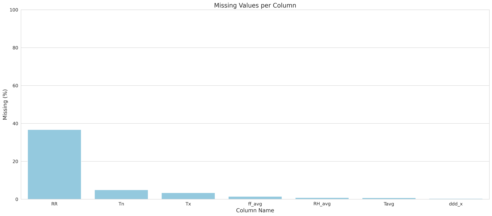

**Label distribution**

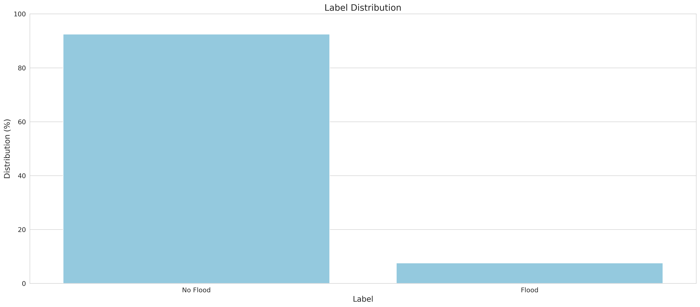

**Region distribution**

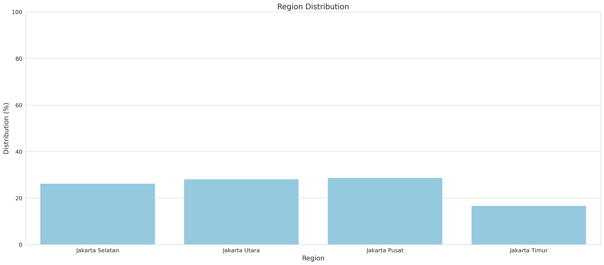

**Feature histograms**

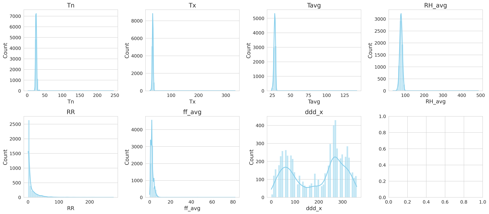

**Correlation of numeric features with the flood label**

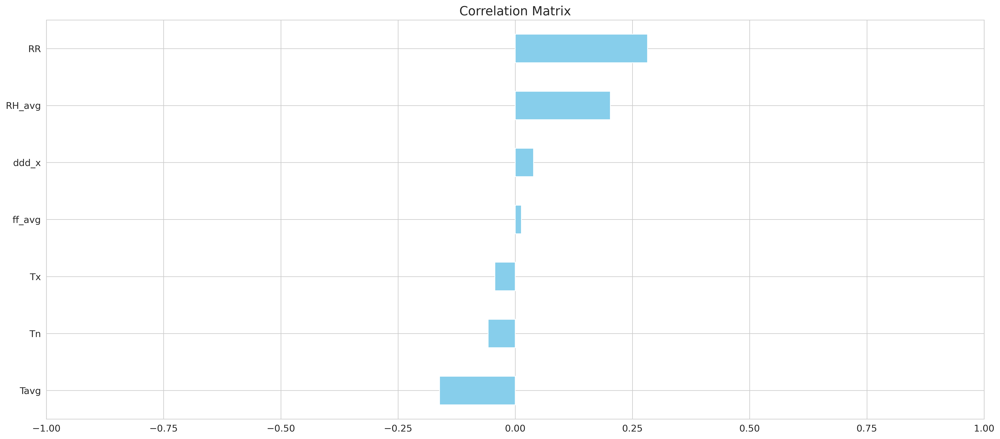

**Feature correlation heatmap**

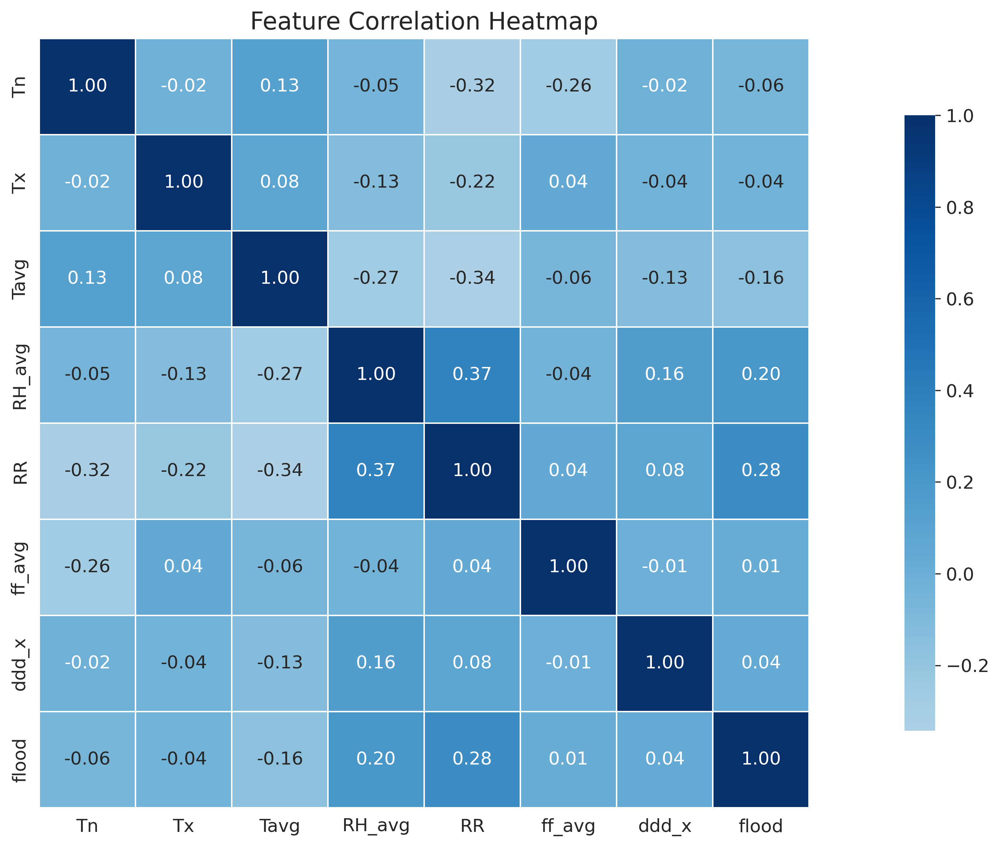

**Rainfall distribution by flood label**

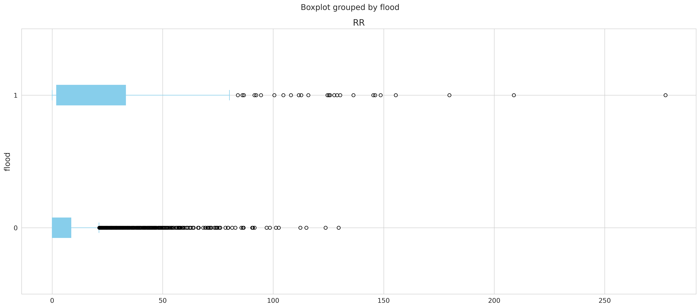

---

## Methodology

### 1. Preprocessing

- Rows sorted chronologically per region to preserve temporal order
- `region_name` label encoded to `region_id`
- `RR` (rainfall) missing values filled with `0.0` (no rain)
- All other numeric columns imputed via per region forward and backward fill, then global mean
- `ddd_x` (wind direction in degrees) decomposed into `wind_direction_sin` and `wind_direction_cos` to preserve circular continuity

### 2. Train, Validation, Test Split

Temporal split, no shuffling, to prevent data leakage:

| Split      | Proportion | Date Range                     |
|------------|------------|--------------------------------|
| Train      | 70%        | Earliest to approximately 70th percentile |
| Validation | 15%        | 70th to 85th percentile        |
| Test       | 15%        | 85th percentile to latest      |

Features are scaled using `RobustScaler` fitted exclusively on the training set.

---

## Feature Engineering

All features are computed in strict temporal order, grouped by `region_id`, to avoid leakage.

### Temporal Cyclical Encoding

| Feature      | Formula                              |
|--------------|--------------------------------------|
| `month_sin`  | `sin(2 * pi * month / 12)`           |
| `month_cos`  | `cos(2 * pi * month / 12)`           |
| `day_sin`    | `sin(2 * pi * day_of_year / 365)`    |
| `day_cos`    | `cos(2 * pi * day_of_year / 365)`    |

### Rainfall Lag Features

| Feature           | Description                   |
|-------------------|-------------------------------|
| `rainfall_lag1d`  | Rainfall 1 day prior          |
| `rainfall_lag3d`  | Rainfall 3 days prior         |
| `rainfall_lag7d`  | Rainfall 7 days prior         |

### Rainfall Rolling Window Features

| Feature                  | Window | Aggregation |
|--------------------------|--------|-------------|
| `rainfall_rolling3d_sum` | 3 days | Sum         |
| `rainfall_rolling7d_sum` | 7 days | Sum         |
| `rainfall_rolling14d_sum`| 14 days| Sum         |
| `rainfall_rolling3d_max` | 3 days | Max         |
| `rainfall_rolling7d_max` | 7 days | Max         |
| `rainfall_rolling7d_std` | 7 days | Standard deviation |

### Humidity Rolling Window Features

| Feature                    | Window | Aggregation |
|----------------------------|--------|-------------|
| `humidity_rolling3d_mean`  | 3 days | Mean        |
| `humidity_rolling7d_mean`  | 7 days | Mean        |

All rainfall based features are log transformed via `log1p` to reduce skewness.

The final feature set used for modeling consists of 24 columns, listed in `FEATURE_COL` within the training notebook.

---

## Model Training

**Primary model:** `XGBClassifier` (XGBoost)

**Baseline run:** A fixed parameter XGBoost model (`n_estimators=300`, `learning_rate=0.05`, `max_depth=6`, `subsample=0.8`, `colsample_bytree=0.8`) is trained with `compute_sample_weight("balanced")` to verify the pipeline before tuning. Its performance on the training and validation sets is reported using ROC AUC, average precision, and a classification report.

---

## Hyperparameter Tuning

**Tuning framework:** [Optuna](https://optuna.org/) with the TPE sampler over 60 trials.

**Objective function:** F2 score at a threshold of 0.5 on the validation set. F2 is chosen over F1 to weight recall more heavily, since missing a flood event (false negative) is costlier than a false alarm.

**Search space:**

| Parameter           | Range / Type              |
|---------------------|---------------------------|
| `n_estimators`      | 100 to 2000                |
| `learning_rate`     | 0.005 to 0.15 (log scale)  |
| `max_depth`         | 3 to 7                     |
| `min_child_weight`  | 1 to 30                    |
| `subsample`         | 0.6 to 1.0                 |
| `colsample_bytree`  | 0.5 to 1.0                 |
| `colsample_bylevel` | 0.5 to 1.0                 |
| `colsample_bynode`  | 0.5 to 1.0                 |
| `gamma`             | 0.0 to 15.0                |
| `reg_alpha`         | 1e-4 to 50.0 (log scale)   |
| `reg_lambda`        | 0.01 to 20.0 (log scale)   |
| `scale_pos_weight`  | 1.0 to 15.0                |
| `max_delta_step`    | 0 to 10                    |

**Final model:** Trained on the combined train and validation set using the best Optuna parameters.

**Threshold selection:** A separate model is fit on the training set only and used to score the validation set. Precision, recall, and F2 are computed across thresholds to identify the threshold that maximizes F2. This same procedure is then repeated on the test set predictions of the final model to confirm the operating threshold used for evaluation, which selects a best F2 threshold of approximately **0.39**.

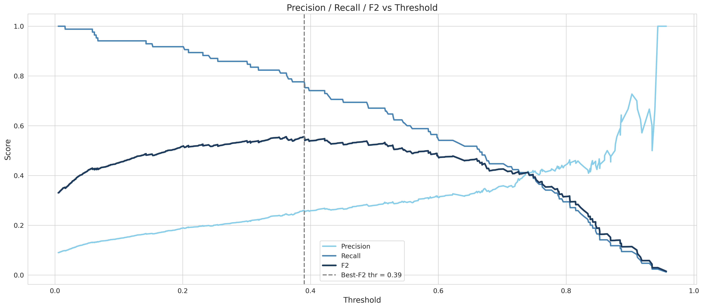

---

## Model Evaluation

Evaluation metrics are computed on the temporally held out **test set** using the final model at the selected threshold of 0.39.

**ROC and Precision-Recall curves**

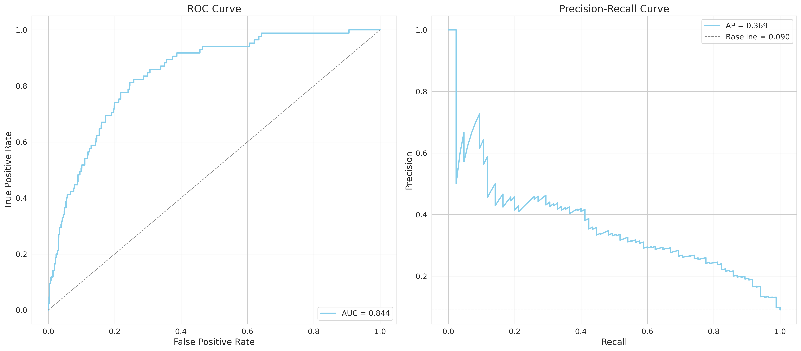

**Confusion matrix**

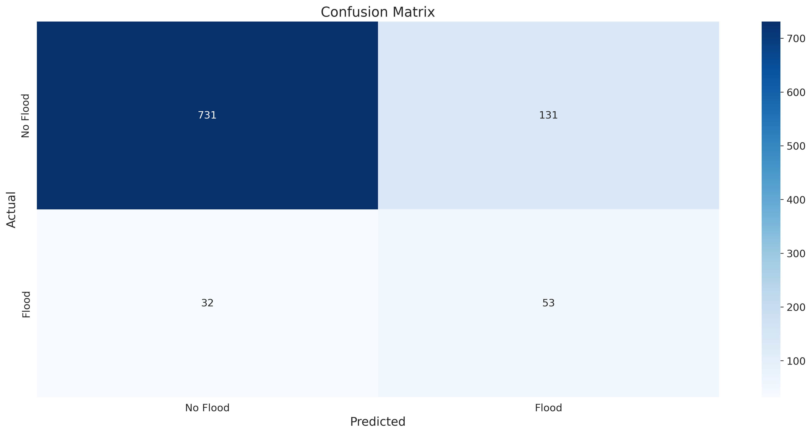

**Feature importance (gain)**

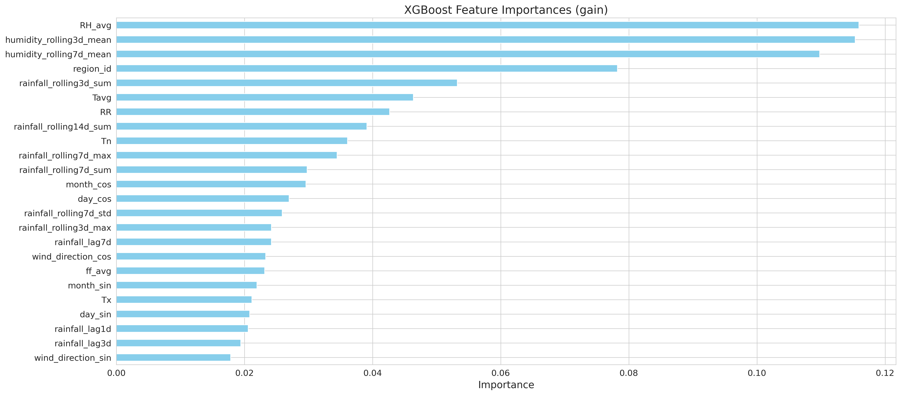

Reported metrics include ROC AUC, average precision (PR AUC), and a classification report (precision, recall, F1 per class). Detailed values are logged in the training notebook output cells.

---

## Baseline Comparison

To contextualize the tuned XGBoost model, two additional baseline models are trained on the combined train and validation set and evaluated on the test set:

- **Logistic Regression** (`max_iter=2000`, `class_weight="balanced"`)
- **Random Forest** (`n_estimators=400`, `class_weight="balanced"`)

Each model is compared against the XGBoost model at both a default threshold of 0.50 and the tuned threshold, using ROC AUC, average precision, precision, recall, F1, and F2.

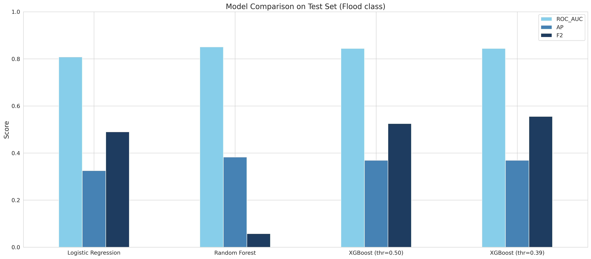

---

## Inference Pipeline

The inference notebook (`inference.ipynb`) runs a live prediction for the next 5 days across all four Jakarta regions.

**Steps:**

1. Fetch the 5 day, 3 hour forecast from the OpenWeatherMap API for each region's coordinates
2. Aggregate 3 hour slots into daily records (minimum, maximum, and mean temperature, total rainfall, mean humidity, mean wind speed, circular mean wind direction)
3. Apply the same feature engineering logic used in training (lag features, rolling windows, log transforms)
4. Scale features with the saved `RobustScaler`
5. Predict flood probability using the saved XGBoost model from the checkpoint
6. Apply the flood alert threshold to generate binary alerts

**Output columns:**

| Column               | Description                           |
|----------------------|---------------------------------------|
| `region_name`        | Jakarta administrative region         |
| `date`               | Forecast date                         |
| `RR`                 | Forecasted daily rainfall (mm)        |
| `RH_avg`             | Forecasted average humidity (%)       |
| `Tavg`               | Forecasted average temperature (degrees C) |
| `flood_probability`  | Model output probability (0.0 to 1.0) |
| `alert_label`        | `No Flood` or `Flood`                 |

---

## Setup and Usage

### Requirements

```bash
pip install xgboost optuna scikit-learn pandas numpy matplotlib seaborn requests kagglehub
```

### Training

1. The dataset is downloaded automatically through `kagglehub.dataset_download("christopherrichardc/climate-and-flood-jakarta")`. A Kaggle account and API credentials configured in the environment are required.
2. Mount Google Drive and set `MODEL_DIR` and `PLOT_DIR` to your desired checkpoint and plot output folders.
3. Run all cells in `training.ipynb`.

The notebook will:
- Perform EDA and save visualizations to `PLOT_DIR`
- Preprocess and engineer features
- Train a baseline XGBoost model
- Run Optuna hyperparameter search (60 trials)
- Retrain the final model on train and validation data
- Select the best F2 threshold
- Train Logistic Regression and Random Forest baselines for comparison
- Save `model_data.pkl` to `MODEL_DIR`

### Inference

1. Copy `model_data.pkl` to `/content/` (or update `MODEL_PATH`)
2. Set your OpenWeatherMap API key in `OWM_API_KEY`
3. Run all cells in `inference.ipynb`

Output is a DataFrame showing flood probability and alert status per region per day for the next 5 days.

---

## Configuration

| Variable          | Location           | Description                                     |
|-------------------|--------------------|-------------------------------------------------|
| `DATA_DIR`        | `training.ipynb`   | Path to the downloaded `data_finish.csv` file    |
| `MODEL_DIR`       | `training.ipynb`   | Directory to save the model checkpoint           |
| `PLOT_DIR`        | `training.ipynb`   | Directory to save generated plots                |
| `MODEL_PATH`      | `inference.ipynb`  | Path to `model_data.pkl`                         |
| `OWM_API_KEY`     | `inference.ipynb`  | OpenWeatherMap API key                           |
| `OWM_UNITS`       | `inference.ipynb`  | Unit system (`metric` for degrees C, mm, m/s)    |
| `REGIONS`         | `inference.ipynb`  | Dictionary of region name to (lat, lon) coordinates |
| `FLOOD_THRESHOLD` | `inference.ipynb`  | Probability threshold for flood alert (set to the tuned value, approximately 0.39) |

---

## Model Checkpoint

`model_data.pkl` is a Python pickle file containing the following keys:

| Key                | Type            | Description                                      |
|---------------------|-----------------|--------------------------------------------------|
| `le_region`          | `LabelEncoder`  | Fitted encoder for `region_name` to `region_id`   |
| `region_map`         | `dict`          | Human readable `{region_name: region_id}` map     |
| `feature_cols`       | `list[str]`     | Ordered list of 24 feature column names           |
| `scaler`              | `RobustScaler`  | Fitted scaler (trained on the training split only)|
| `additional_model`    | `dict`          | Comparison baselines, with keys `logreg` (`LogisticRegression`) and `rf` (`RandomForestClassifier`) |
| `best_model`          | `dict`          | Final XGBoost model, with keys `xgb_model` (`XGBClassifier`), `xgb_params` (best Optuna hyperparameters), and `xgb_threshold` (tuned F2 threshold, approximately 0.39) |

---

## Limitations and Future Work

**Current limitations:**

- Inference lag features (`lag1d`, `lag3d`, `lag7d`) are derived only from the 5 day forecast window, not from actual historical station data, which may reduce accuracy for the first few forecast days
- The model is trained on station level data but inference uses grid point API data, so systematic biases may exist between the two
- Jakarta Barat is not included in the current region set
- The final threshold of approximately 0.39 is derived from the same test set used for reporting metrics, so it should be treated as an upper bound estimate rather than a strictly independent evaluation